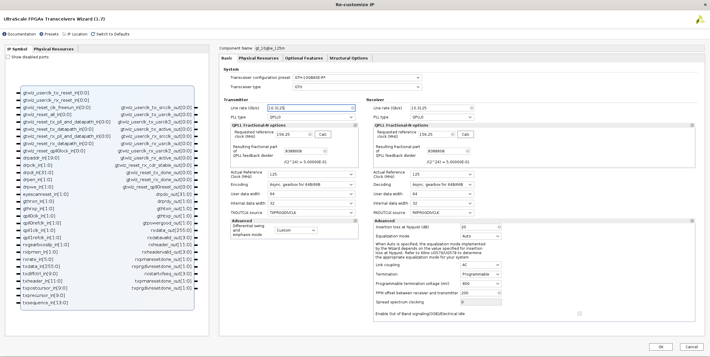
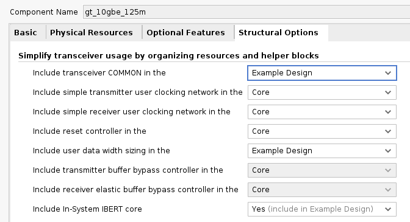
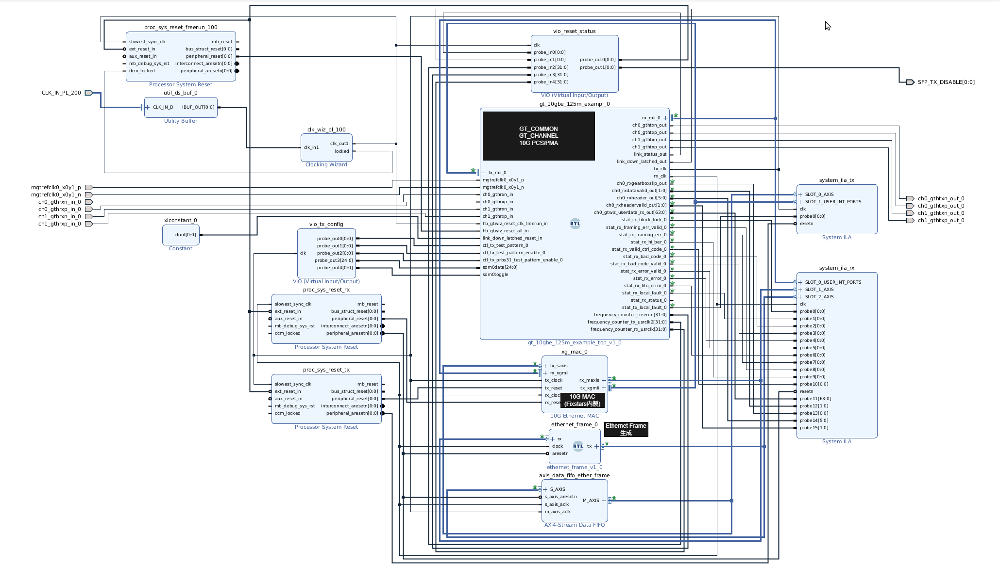

# 続 <br/> 腕の見せ所が満載なFPGA開発ボードのすすめ 

<!--
_class: lead
_paginate: false
_header: ""
-->

<style>
img[alt~="center"] {
  display: block;
  margin: 0 auto;
}
</style>

## 自己紹介


* 井田　健太
* FPGAの論理設計屋だった気がする
  * Vivadoぽちぽちマンは望月さんに引き継いでもらいました
* 最近は組込みRust屋になった気がする

## 前回までのおさらい


* 中国のFPGAボードメーカー **ALINX** の <br/> Xilinx Zynq Ultrascale+ボード **AXU5EV-P** を紹介
  * XCZU5EV搭載 (KV260とかと同じ型式)
  * 豊富なインターフェースを搭載
    * PCIe Gen3 x2
    * SFP+スロット x2
    * HDMI In/Out
    * etc...

## AXU5EV-Pを使って試したいこと

* Alveo U50のような **10GbEで入出力** しつつ、ホストと **PCIe** で通信したい
* AXU5EV-PはSFP+スロット付きのPCIeカード形状のFPGAボードなのでぴったり



## AXU5EV-Pの購入元

* Amazon.com もしくは aliexpress
* 現時点での価格: $1660
  * $1 = ￥145 で24万円強
* (余談) 筆者購入時より7万円くらい上がっている… 円安ｺﾜｲ

## AXU5EV-Pの問題点

* 前回発表時は 10GbE 通信が出来なかった
* 原因： AXU5EV-Pに搭載されているクロックが10GbE用ではない
  * 10GbEには156.25[MHz] もしくは 161.13[MHz] のクロックが必要
  * 10GbE = 10.3125[Gbps] = 156.25[MHz] * 66 = 161.13[MHz] * 64
* なぜか125[MHz]のクロックがGTHに接続されている
  * (GTPのGbE用と間違ったんでは…)
    * GTH用回路図に

## 10GbEクロックがない問題の対策

1. FPGA内部で156.25[MHz] を作ってGTHに突っ込む
2. クロックの部品を張り替える
3. GTHのFractional-N機能を使って125[MHz]から10.3125[GHz]を作る

## GTHの構成



## GTHの構成


* GTHにつき
  * QPLL (高周波発振用PLL) x2
  * GTチャネル (高速SERDES) x4
* GTチャネルにつき
  * CPLL (低周波発振用PLL) x1
* AXU5EV-PはGTHが1つのFPGAを使用
  * SFP+とPCIeで共用

## AXU5EV-PでのGTHの構成




## FPGA内部で156.25[MHz] を作る



* AXU5EV-Pには200[MHz]のPL用クロックがついている
* MMCMをつかって内部で156.25[MHz]を合成
  * 出力ジッタ最小の構成
* GTGREFCLKからGTHに入力
* UG576では GTGREFCLKは**使うな**と書かれている

## FPGA内部で156.25[MHz] を作る


* GTGREFCLKからGTHに入力
* UG576では GTGREFCLKは**使うな**と書かれている
  * FPGA内部ロジックからのクロックだとジッタが許容範囲外になる
  * 電源雑音など

## 試した結果

* QPLLのクロックが安定せず
  * UG576記載通り

* ここまでが前回発表までの内容

## クロックの部品を張り替える(1/4)

* AXU5EV-PのGTH用リファレンスクロックは <br/>SiTimeの **SiT9121** シリーズ
  * SiT9121AI-2B1-33E125.000000
  * 3.3V LVDS, 125[MHz], 3.2[mm]x2.5[mm], ±20[ppm]
* 同系列の 156.25[MHz]品 **SiT9121AI-2B1-33E156.250000**
* DigiKey, Mouserなどで取り扱いあり
* と、おもいきや、在庫がない!
  * 半導体不足の影響か…

## クロックの部品を張り替える(2/4)

* **SiT9121AI-2BF-XXS156.250000G** の在庫はあった
  * LVDS, 156.25[MHz], 3.2[mm]x2.5[mm] までは同一
  * "F" なので ±10[ppm]
  * "XX" なので 2.25~3.63[V]
  * "S" なので Standbyピン
    * c.f. "E"はOutput Enableなので論理が逆

* Output Enableだけどうにかすれば使えそう

## クロックの部品を張り替える(3/4)

* SiT9121のStandby/Output Enableピンの仕様
  * Standby: 
    * **H** または **NC** でクロック出力有効 
    * **L** でスリープ状態
  * Output Enable: 
    * **H** または **NC** でクロック出力有効
    * **L** でクロック出力がHi-Z
* AXU5EV-Pでは **H** にプルアップされてるのでそのままつかえる

## クロックの部品を張り替える(4/4)

* マルツのDigiKey提携を利用して4つほど注文
  * 1つ1236円… 結構いい値段します
* 手元に届いてはいるが、まだ試していない
* もう少し非侵襲的な方法での解決を模索したい

## GTHのFractional-N機能を試す(1/2)

* QPLLに搭載されている非整数比のクロックを生成する機能
* 通常のPLLはVCOからの出力を1/N分周したものを位相比較器にいれてフィードバック制御する
* Fractional-Nでは、分周器の代わりにSDM (ΣΔ変調器) をつかって、端数での分周を行う
 


## GTHのFractional-N機能を試す(2/2)

* 疑問：ΣΔ変調とか、ジッタ増えそうだけど大丈夫なのか？
* XAPP1276にFractional-NVCXOの代替をするという内容のアプリケーションノートがあるので大丈夫そうと判断
  * https://docs.xilinx.com/v/u/en-US/xapp1276-vcxo
* GbE単体デザインを作って試してみる

## GTHの設定



## GT Wizardの設定



* 一部をExample Design側に置くように設定
* IBERTを有効化

## プロジェクトの作成

* GTHの設定は複雑なので、example designを元にデザインを作成する



## プロジェクトの作成


## 余談：RTLモジュール使用時の便利機能 (1/6)

* Vivado 2019くらい？から、IP Integratorに簡単にRTLモジュールを配置する機能が追加された
* *.v ファイルをD&Dするだけ
  * (*.sv だと怒られるのはどうにかしてほしい…)
* 仕組みは、 IP Packagerのインターフェース自動推論とほぼ同じ

## 余談：RTLモジュール使用時の便利機能 (2/6)

* 欠点：自動推論がうまくいかなくて困ったことになる
  * クロック周りの設定とかでIP IntegeratorのValidationで怒られたりする
  * リセットの極性… **n** がついてれば負論理だが、正論理は…

## 余談：RTLモジュール使用時の便利機能 (3/6)

* UG994のRTLモジュールのところにいろいろ書いてある
  * https://docs.xilinx.com/r/en-US/ug994-vivado-ip-subsystems/Referencing-RTL-Modules
* 様々な属性を記述することにより、RTLモジュールのインターフェースやクロック周波数のプロパティを設定可能
  * `X_INTERFACE_INFO`, `X_INTERFACE_PARAMETER` など
* 今回は GT WIzardで生成したモジュールをIP Integratorに配置するのに利用

## 余談：RTLモジュール使用時の便利機能 (4/6)

* クロック出力のクロック周波数を `FREQ_HZ` に設定
  * 156.25[MHz]を設定

```verilog
  // TX/RX clocks
  (* X_INTERFACE_PARAMETER = "FREQ_HZ 156250000,ASSOCIATED_BUSIF tx_mii_0:stat_tx_local_fault_0" *)
  output wire tx_clk,
  (* X_INTERFACE_PARAMETER = "FREQ_HZ 156250000,..." *)
  output wire rx_clk,
```

## 余談：RTLモジュール使用時の便利機能 (5/6)

* リセットの極性を `POLARITY` に設定
  * `ACTIVE_HIGH`

```verilog
  // User-provided ports for reset helper block(s)
  (* X_INTERFACE_PARAMETER = "POLARITY ACTIVE_HIGH" *)
  input  wire hb_gtwiz_reset_clk_freerun_in,
  (* X_INTERFACE_PARAMETER = "POLARITY ACTIVE_HIGH" *)
  input  wire hb_gtwiz_reset_all_in,
```

## 余談：RTLモジュール使用時の便利機能 (6/6)

* MIIのインターフェース定義
  * `X_INTERFACE_MODE` で `SLAVE` `MASTER` 設定
    * `MONITOR` にも出来る模様

```verilog
  // MII signals for port 0
  (* X_INTERFACE_MODE = "SLAVE" *)
  (* X_INTERFACE_INFO = "xilinx.com:display_xxv_ethernet:user_int_ports:* tx_mii_0 tx_mii_d" *)
  input wire [63:0] tx_mii_d_0,
  (* X_INTERFACE_INFO = "xilinx.com:display_xxv_ethernet:user_int_ports:* tx_mii_0 tx_mii_c" *)
  input wire [ 7:0] tx_mii_c_0,
  (* X_INTERFACE_MODE = "MASTER" *)
  (* X_INTERFACE_INFO = "xilinx.com:display_xxv_ethernet:user_int_ports:* rx_mii_0 rx_mii_d" *)
  output wire [63:0] rx_mii_d_0,
  (* X_INTERFACE_INFO = "xilinx.com:display_xxv_ethernet:user_int_ports:* rx_mii_0 rx_mii_c" *)
  output wire [ 7:0] rx_mii_c_0,
```

## Ethernetフレーム生成回路(1/2)

```verilog
  tx_tvalid <= state > 0;
  if( tx_tvalid && tx_tready ) begin
      state <= state + 1;
  end
  case(state)
      0: begin
          interval_counter <= interval_counter + 1;
          if( interval_counter == 10'd1023 ) begin
              interval_counter <= 0;
              state <= 1;
          end
      end
      1:  begin tx_tdata <= 64'h0123456789abcdef; tx_tkeep <= 8'hff; tx_tlast <= 0; end
      2:  begin tx_tdata <= 64'hdeadbeefcafebeef; tx_tkeep <= 8'hff; tx_tlast <= 0; end
      3:  begin tx_tdata <= 64'h0000000000000000; tx_tkeep <= 8'hff; tx_tlast <= 0; end
      // ...
      10: begin tx_tdata <= 64'h0000000000000000; tx_tkeep <= 8'hff; tx_tlast <= 1; state <= 0; end
  endcase
```

## Ethernetフレーム生成回路(2/2)

* 単純に64bit (8バイト) x 10のデータをひたすらAXI Streamから出力するロジック
* 10GbE MACのAXIS入力に接続して、10GbEから送信
* 10GbE MACのAXIS出力のTREADYを常に `1` にして、データを捨てるようにする
  * IP Integrator上のILAで観測する

## 動作確認


## まとめ

* Fractional-Nをつかって10GbE Ethernetの送信は成功するようになった
* 受信側はもうすこし調整が必要そう
* 最悪の場合は、調達した発信器に張り替えることを検討中
